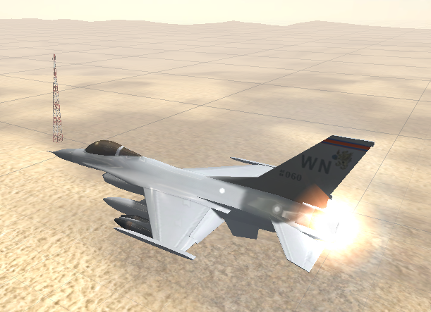
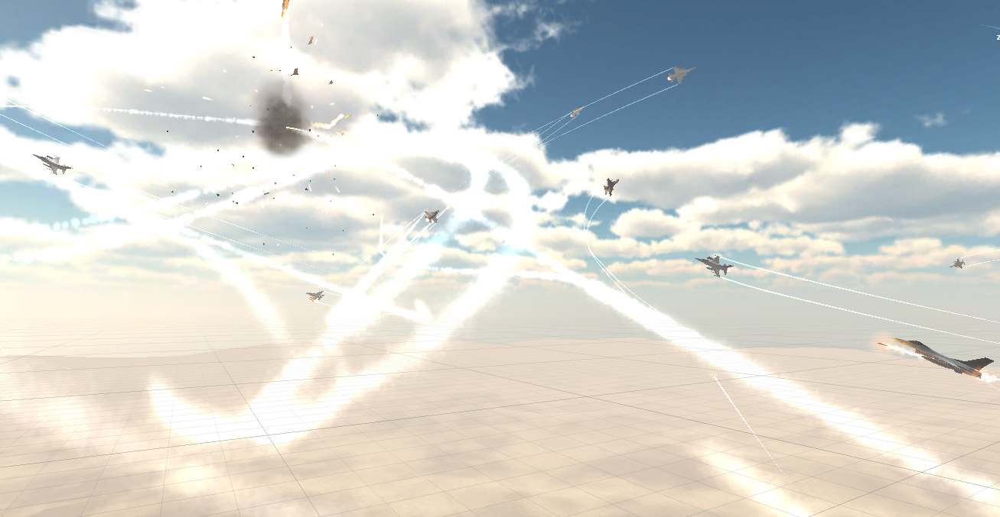

Air Strike
=====

## Purpose
The purpose is to make the fighting game in air for PC and mobile device.

## Description

This game has two types for PC and Android. So, anybody can challenge this game in their computer and mobile device. The game emulates real air battle, so user can enjoy the game in real environment. 
This consists of two parts-classical battle and modern battle.
There is the same environment and plane according each period and also same weapons are used.
               

    

Game is performed to the way that user hit the enemy planes and get scores.
Attack is performed with our army planes and other planes are added.
You have to avoid the attack of enemy planes possibility.
In front of your visual field, your plane can confirm the nearest enemy plane and in modern part, your missile can track the certain enemy plane.
When you receive the attacks of enemy planes, your health is decreased and
If your health is zero, the game is finished.

    

## Game control

-Movement of plane:  
* Left direction : Press "A" key
* Right Direction : Press "D" key
* Rotation of plane : Control Mouse

-Fire : Press Left mouse button

-Change weapon : Press Right mouse button

-Change view : Press "C" key

## Technical specifications

This project has the following technical specifications.

-UI part
*	Menu screen using image button
* GUI buttons or labels using GUISkin

-Main game part
*	control of flighter's movement.
* Explosion effect, track effect using particle of Unity. 
* tracking of missile
* AI control of enemy flighter's movement, tracking, shooting and so on.
* classify between user's team and enemy team.

